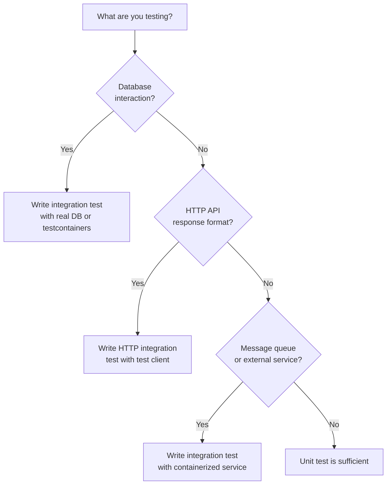

# Integration Testing

> Test how multiple components work together — with real dependencies like databases, message queues, and external APIs.

---

## The Problem with Unit Tests Alone

Unit tests verify that individual pieces of logic are correct. But a bug that only appears when those pieces interact — a wrong SQL query, an ORM mapping error, a misconfigured schema — will be missed.

```python
# All unit tests pass:
def test_save_user():
    mock_db = Mock()
    repo = UserRepository(mock_db)
    repo.save(User(name="Alice", email="alice@b.com"))
    mock_db.execute.assert_called_once()   # ✓ passes

# But the actual SQL has a bug:
class UserRepository:
    def save(self, user: User) -> None:
        self._db.execute(
            "INSERT INTO usrs (name, email) VALUES (%s, %s)",  # ← typo: "usrs" not "users"
            (user.name, user.email),
        )
# Unit test doesn't catch this. Integration test with a real database does.
```

---

## Integration Test vs. Unit Test

| | Unit Test | Integration Test |
|-|-----------|-----------------|
| **Dependencies** | All mocked | Real (database, queue, etc.) |
| **Speed** | Milliseconds | Seconds |
| **Isolation** | Complete | Partial |
| **What it catches** | Logic bugs | Connection, schema, query bugs |
| **Setup** | Minimal | Requires real infrastructure |

---

## Database Integration Tests

### Approach 1: Real Test Database

Spin up a real database for tests. Each test runs in a transaction that is rolled back after the test.

```python
import pytest
import psycopg2
from psycopg2.extensions import ISOLATION_LEVEL_AUTOCOMMIT

TEST_DB_URL = "postgresql://localhost/test_db"

@pytest.fixture(scope="session")
def db_connection():
    """One connection per test session."""
    conn = psycopg2.connect(TEST_DB_URL)
    yield conn
    conn.close()

@pytest.fixture(autouse=True)
def db_transaction(db_connection):
    """Each test gets its own transaction, rolled back afterward."""
    db_connection.autocommit = False
    yield db_connection
    db_connection.rollback()   # Clean up — test data never persists

@pytest.fixture
def user_repo(db_connection):
    return UserRepository(db_connection)

def test_save_and_retrieve_user(user_repo):
    # ARRANGE
    user = User(name="Alice", email="alice@example.com")

    # ACT
    saved = user_repo.save(user)
    retrieved = user_repo.find_by_id(saved.id)

    # ASSERT
    assert retrieved.name == "Alice"
    assert retrieved.email == "alice@example.com"
    assert retrieved.id is not None

def test_find_by_email_returns_none_when_not_found(user_repo):
    result = user_repo.find_by_email("nonexistent@example.com")
    assert result is None

def test_save_fails_on_duplicate_email(user_repo):
    user_repo.save(User(name="Alice", email="alice@example.com"))
    with pytest.raises(DuplicateEmailError):
        user_repo.save(User(name="Alice 2", email="alice@example.com"))
```

### Approach 2: Testcontainers

Automatically spin up a Docker container with the real database for each test run.

```python
import pytest
from testcontainers.postgres import PostgresContainer
import psycopg2

@pytest.fixture(scope="session")
def postgres_container():
    with PostgresContainer("postgres:15") as postgres:
        yield postgres

@pytest.fixture(scope="session")
def db_connection(postgres_container):
    conn = psycopg2.connect(postgres_container.get_connection_url())
    # Run migrations
    with conn.cursor() as cur:
        cur.execute("""
            CREATE TABLE users (
                id SERIAL PRIMARY KEY,
                name TEXT NOT NULL,
                email TEXT UNIQUE NOT NULL,
                created_at TIMESTAMP DEFAULT NOW()
            );
        """)
    conn.commit()
    yield conn
    conn.close()

@pytest.fixture
def user_repo(db_connection):
    return UserRepository(db_connection)

def test_full_user_lifecycle(user_repo):
    # Create
    user = user_repo.save(User(name="Bob", email="bob@example.com"))
    assert user.id is not None

    # Read
    found = user_repo.find_by_id(user.id)
    assert found.name == "Bob"

    # Update
    user_repo.update_email(user.id, "newemail@example.com")
    updated = user_repo.find_by_id(user.id)
    assert updated.email == "newemail@example.com"

    # Delete
    user_repo.delete(user.id)
    assert user_repo.find_by_id(user.id) is None
```

---

## Contract Testing

When Service A calls Service B's API, both need to agree on the contract. Contract testing verifies this without both services running simultaneously.

### Consumer-Driven Contract Testing (Pact)

The **consumer** defines what it expects from the provider. The **provider** verifies it fulfills those expectations.

```python
# Consumer side (Order Service testing its call to Inventory Service)
import pytest
from pact import Consumer, Provider

pact = Consumer("order-service").has_pact_with(Provider("inventory-service"))

@pytest.fixture(scope="module")
def pact_setup():
    pact.start_mocking()
    yield
    pact.stop_mocking()

def test_check_product_availability(pact_setup):
    # Define the expected interaction
    (pact
     .given("product 42 exists with stock 5")
     .upon_receiving("a request for product availability")
     .with_request("GET", "/products/42/availability",
                   query={"quantity": "2"})
     .will_respond_with(200, body={
         "product_id": 42,
         "available": True,
         "stock": 5,
     }))

    # Call the consumer code (uses Pact's mock server)
    inventory_client = InventoryClient("http://localhost:1234")
    result = inventory_client.check_availability(product_id=42, quantity=2)

    assert result["available"] is True
    pact.verify()


# Provider side (Inventory Service verifying it matches the contract)
from pact import Verifier

def test_inventory_service_matches_order_service_contract():
    verifier = Verifier(
        provider="inventory-service",
        provider_base_url="http://localhost:8080",
    )
    success, logs = verifier.verify_pacts(
        pact_file="pacts/order-service-inventory-service.json"
    )
    assert success == 0, f"Pact verification failed: {logs}"
```

---

## HTTP Integration Tests

Test the full HTTP layer (controller + serialization + routing) without starting a real server.

```python
import pytest
from flask.testing import FlaskClient

@pytest.fixture
def client(app) -> FlaskClient:
    return app.test_client()

@pytest.fixture
def auth_headers():
    return {"Authorization": "Bearer valid_test_token"}

def test_get_user_returns_200_for_valid_id(client, user_repo, auth_headers):
    user = user_repo.save(User(name="Alice", email="alice@example.com"))

    response = client.get(f"/api/users/{user.id}", headers=auth_headers)

    assert response.status_code == 200
    data = response.json
    assert data["data"]["name"] == "Alice"
    assert data["data"]["email"] == "alice@example.com"
    assert "id" in data["data"]

def test_get_user_returns_404_for_missing_id(client, auth_headers):
    response = client.get("/api/users/99999", headers=auth_headers)
    assert response.status_code == 404
    assert response.json["error"]["code"] == "USER_NOT_FOUND"

def test_create_user_returns_201_with_valid_data(client, auth_headers):
    response = client.post(
        "/api/users",
        json={"name": "Bob", "email": "bob@example.com"},
        headers=auth_headers,
    )
    assert response.status_code == 201
    assert response.json["data"]["id"] is not None

def test_create_user_returns_422_for_invalid_email(client, auth_headers):
    response = client.post(
        "/api/users",
        json={"name": "Bob", "email": "not-an-email"},
        headers=auth_headers,
    )
    assert response.status_code == 422
```

---

## When to Use Integration Tests



---

## Key Takeaways

- Integration tests catch the bugs that unit tests miss: SQL errors, schema mismatches, serialization bugs.
- Use transaction rollback for database tests — each test starts with a clean slate without a full DB wipe.
- Testcontainers spins up real Docker containers for tests — portable, reproducible, no shared state between runs.
- Contract testing (Pact) verifies API consumers and providers agree without running both simultaneously.
- HTTP integration tests use the framework's test client — full routing + serialization tested without a real server.
