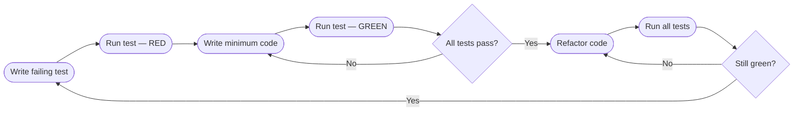

# Test-Driven Development (TDD)

> Write a failing test first, make it pass with the minimum code, then refactor — in a tight loop.

---

## The Problem TDD Solves

When you write code first, tests tend to be written to confirm what the code already does rather than to specify what it should do. This leads to:

- Tests that miss edge cases (the code "teaches" you what to test)
- Hard-to-test code (the design wasn't driven by testability)
- Refactoring fear (tests are an afterthought, not a safety net)
- Overbuilding (you write features nobody verified are needed)

TDD inverts the process: the test defines the requirement before any code exists.

---

## Red → Green → Refactor

The TDD cycle has three phases, repeated continuously.

```
┌─────────────────────────────────────────────────────┐
│                                                     │
│   RED      → Write a failing test                   │
│   GREEN    → Write the minimum code to pass it      │
│   REFACTOR → Clean up without breaking the test     │
│                                                     │
│   Repeat for every new behavior.                    │
│                                                     │
└─────────────────────────────────────────────────────┘
```



---

## Worked Example: Building a Password Validator

We'll build a `PasswordValidator` step by step using TDD. We have no implementation yet — only requirements:

1. Password must be at least 8 characters
2. Password must contain at least one uppercase letter
3. Password must contain at least one digit
4. Password must contain at least one special character

### Step 1 — RED: Write the first failing test

```python
# tests/test_password_validator.py
import pytest
from myapp.password_validator import PasswordValidator, ValidationError

def test_password_too_short_raises_error():
    validator = PasswordValidator()
    with pytest.raises(ValidationError, match="at least 8 characters"):
        validator.validate("Short1!")
```

Run the test:
```
pytest tests/test_password_validator.py
ERROR: ModuleNotFoundError: No module named 'myapp.password_validator'
```

The test fails because nothing exists yet. That is the correct starting state.

---

### Step 2 — GREEN: Write the minimum code to pass it

```python
# myapp/password_validator.py

class ValidationError(ValueError):
    pass

class PasswordValidator:
    def validate(self, password: str) -> None:
        if len(password) < 8:
            raise ValidationError("Password must be at least 8 characters")
```

Run the test:
```
PASSED  test_password_too_short_raises_error
```

Only enough code to make this one test pass. Nothing more.

---

### Step 3 — RED: Add the next test (uppercase requirement)

```python
def test_password_without_uppercase_raises_error():
    validator = PasswordValidator()
    with pytest.raises(ValidationError, match="uppercase"):
        validator.validate("alllowercase1!")
```

Run:
```
FAILED  test_password_without_uppercase_raises_error
  AssertionError: DID NOT RAISE
```

---

### Step 4 — GREEN: Make the new test pass

```python
class PasswordValidator:
    def validate(self, password: str) -> None:
        if len(password) < 8:
            raise ValidationError("Password must be at least 8 characters")
        if not any(c.isupper() for c in password):
            raise ValidationError("Password must contain at least one uppercase letter")
```

```
PASSED  test_password_too_short_raises_error
PASSED  test_password_without_uppercase_raises_error
```

---

### Step 5 — Continue the cycle for digits and special characters

```python
# Add both tests
def test_password_without_digit_raises_error():
    validator = PasswordValidator()
    with pytest.raises(ValidationError, match="digit"):
        validator.validate("NoDigitsHere!")

def test_password_without_special_char_raises_error():
    validator = PasswordValidator()
    with pytest.raises(ValidationError, match="special"):
        validator.validate("NoSpecial123")
```

Make them pass:

```python
import re

class PasswordValidator:
    _SPECIAL = re.compile(r'[!@#$%^&*(),.?":{}|<>]')

    def validate(self, password: str) -> None:
        if len(password) < 8:
            raise ValidationError("Password must be at least 8 characters")
        if not any(c.isupper() for c in password):
            raise ValidationError("Password must contain at least one uppercase letter")
        if not any(c.isdigit() for c in password):
            raise ValidationError("Password must contain at least one digit")
        if not self._SPECIAL.search(password):
            raise ValidationError("Password must contain at least one special character")
```

---

### Step 6 — GREEN: Test the happy path (valid password)

```python
def test_valid_password_does_not_raise():
    validator = PasswordValidator()
    validator.validate("SecurePass1!")   # must not raise
```

This passes immediately — existing implementation already handles it.

---

### Step 7 — REFACTOR: Clean up without breaking tests

Now that all tests pass, we can improve the structure:

```python
import re
from dataclasses import dataclass, field
from typing import Callable

class ValidationError(ValueError):
    pass

@dataclass
class PasswordRule:
    description: str
    check: Callable[[str], bool]

    def passes(self, password: str) -> bool:
        return self.check(password)


class PasswordValidator:
    _SPECIAL = re.compile(r'[!@#$%^&*(),.?":{}|<>]')

    _RULES: list[PasswordRule] = [
        PasswordRule(
            "at least 8 characters",
            lambda p: len(p) >= 8,
        ),
        PasswordRule(
            "at least one uppercase letter",
            lambda p: any(c.isupper() for c in p),
        ),
        PasswordRule(
            "at least one digit",
            lambda p: any(c.isdigit() for c in p),
        ),
        PasswordRule(
            "at least one special character",
            lambda p: bool(re.compile(r'[!@#$%^&*(),.?":{}|<>]').search(p)),
        ),
    ]

    def validate(self, password: str) -> None:
        for rule in self._RULES:
            if not rule.passes(password):
                raise ValidationError(f"Password must contain {rule.description}")
```

Run all tests — still green. The refactor added clarity without changing behavior.

---

### Step 8 — Add edge case tests discovered during refactor

TDD catches cases you'd otherwise miss:

```python
def test_empty_password_raises_length_error():
    validator = PasswordValidator()
    with pytest.raises(ValidationError, match="8 characters"):
        validator.validate("")

def test_validation_reports_first_failing_rule():
    validator = PasswordValidator()
    with pytest.raises(ValidationError) as exc_info:
        validator.validate("short")         # fails length first
    assert "8 characters" in str(exc_info.value)

@pytest.mark.parametrize("password", [
    "SecurePass1!",
    "An0ther$trong",
    "C0mpl3x@Word",
])
def test_valid_passwords_are_accepted(password):
    PasswordValidator().validate(password)  # no exception
```

---

## TDD for a Complete Feature: Shopping Cart Discount

A fuller example showing TDD driving the design of a `ShoppingCart`.

```python
# tests/test_shopping_cart.py

from decimal import Decimal
import pytest
from myapp.cart import ShoppingCart, Item

# --- Iteration 1: Cart starts empty ---

def test_new_cart_has_zero_total():
    cart = ShoppingCart()
    assert cart.total() == Decimal("0.00")

# --- Iteration 2: Adding items ---

def test_adding_item_increases_total():
    cart = ShoppingCart()
    cart.add(Item(name="Book", price=Decimal("19.99")))
    assert cart.total() == Decimal("19.99")

def test_adding_multiple_items_sums_correctly():
    cart = ShoppingCart()
    cart.add(Item(name="Book", price=Decimal("10.00")))
    cart.add(Item(name="Pen", price=Decimal("2.50")))
    assert cart.total() == Decimal("12.50")

# --- Iteration 3: Quantity ---

def test_item_with_quantity_multiplies_price():
    cart = ShoppingCart()
    cart.add(Item(name="Book", price=Decimal("10.00")), quantity=3)
    assert cart.total() == Decimal("30.00")

# --- Iteration 4: Discount ---

def test_no_discount_below_100():
    cart = ShoppingCart()
    cart.add(Item(name="Widget", price=Decimal("99.99")))
    assert cart.total() == Decimal("99.99")    # no discount

def test_10_percent_discount_at_100_or_above():
    cart = ShoppingCart()
    cart.add(Item(name="Widget", price=Decimal("100.00")))
    assert cart.total() == Decimal("90.00")    # 10% off

def test_discount_applied_after_summing_all_items():
    cart = ShoppingCart()
    cart.add(Item(name="A", price=Decimal("60.00")))
    cart.add(Item(name="B", price=Decimal("50.00")))  # total = 110, 10% off = 99.00
    assert cart.total() == Decimal("99.00")
```

Implementation driven by these tests (written incrementally):

```python
# myapp/cart.py
from decimal import Decimal
from dataclasses import dataclass, field

@dataclass
class Item:
    name: str
    price: Decimal

@dataclass
class CartLine:
    item: Item
    quantity: int

    @property
    def subtotal(self) -> Decimal:
        return self.item.price * self.quantity

class ShoppingCart:
    def __init__(self):
        self._lines: list[CartLine] = []

    def add(self, item: Item, quantity: int = 1) -> None:
        self._lines.append(CartLine(item=item, quantity=quantity))

    def _subtotal(self) -> Decimal:
        return sum((line.subtotal for line in self._lines), Decimal("0.00"))

    def total(self) -> Decimal:
        subtotal = self._subtotal()
        if subtotal >= Decimal("100.00"):
            return (subtotal * Decimal("0.90")).quantize(Decimal("0.01"))
        return subtotal
```

Every method exists because a test required it. Nothing more.

---

## What TDD is NOT

```python
# NOT TDD: writing tests after the code
def calculate_discount(total):
    if total >= 100:
        return total * 0.9
    return total

# Then "testing" it:
def test_discount():
    assert calculate_discount(100) == 90   # just confirms what you already wrote
```

Real TDD means the test is written when you don't yet know how the implementation will look. The test is a specification, not a confirmation.

---

## TDD and Design

TDD tends to produce better-designed code because:

- Hard-to-test code is hard to think about → TDD forces you to simplify interfaces
- A class that needs 10 mocked dependencies in a test is a class with too many responsibilities
- If you can't write a test in 5 lines, the function probably does too much

```python
# If this test setup is this painful, the design is wrong:
def test_something():
    db = Mock()
    cache = Mock()
    email = Mock()
    sms = Mock()
    logger = Mock()
    config = Mock()
    validator = Mock()
    service = MyService(db, cache, email, sms, logger, config, validator)
    ...
```

TDD would have forced you to notice this before writing the class.

---

## Key Takeaways

- TDD cycle: Red (failing test) → Green (minimum code) → Refactor (clean up).
- Write the test before the code — the test specifies behavior, not the implementation.
- Write only enough code to make the current test pass. Nothing more.
- Refactor freely once all tests are green — they are your safety net.
- Hard-to-test code is a design signal: simplify the interface, not the test.
