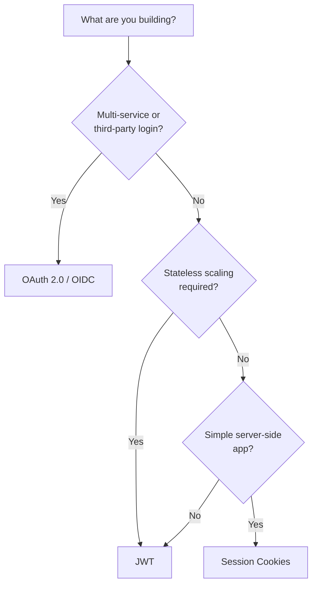
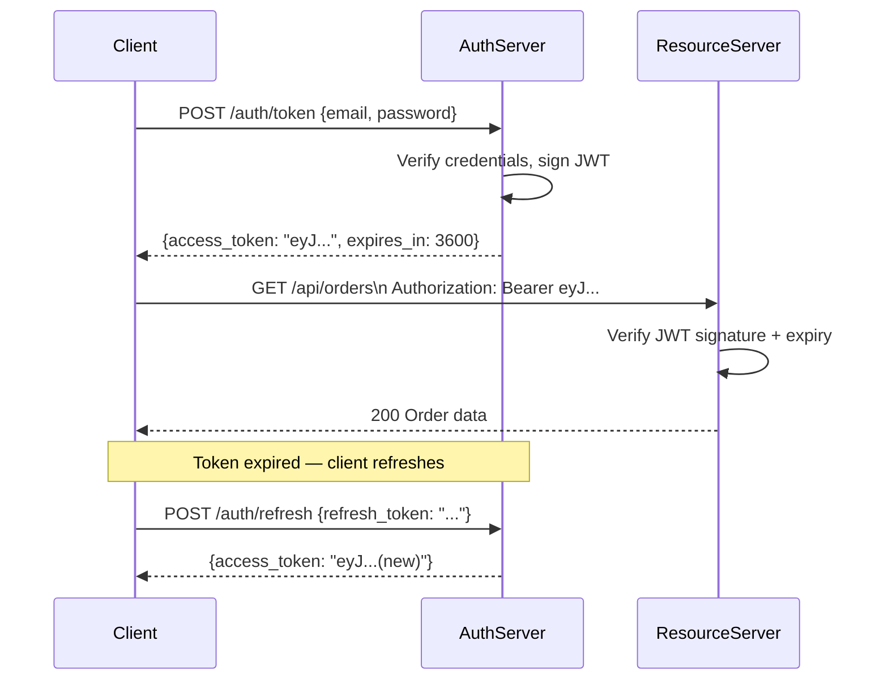
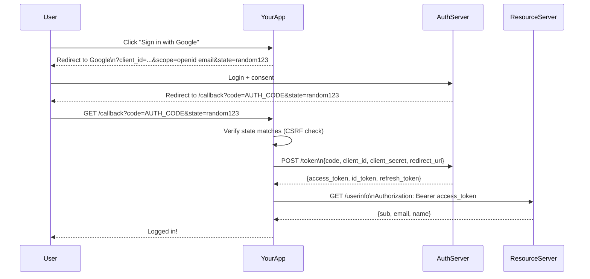

# Authentication Patterns

> Verify who is making a request — and keep that verification secure across the lifetime of a session.

---

## The Problem

Authentication is the gateway to every protected resource. The wrong pattern for your context introduces vulnerabilities:

- Storing sessions server-side doesn't scale horizontally without shared state
- JWTs can't be revoked without extra infrastructure
- Rolling your own OAuth implementation is how credentials get stolen
- Mixing authentication (who you are) with authorization (what you can do) produces unmaintainable code

---

## Pattern Overview



---

## Pattern 1: Session Cookies

The server stores session state. The client holds only a session ID in a cookie.

```mermaid
sequenceDiagram
    participant Browser
    participant Server
    participant SessionStore

    Browser->>Server: POST /login {email, password}
    Server->>Server: Verify credentials
    Server->>SessionStore: Store session {user_id, roles, expires}
    Server-->>Browser: Set-Cookie: session_id=abc123; HttpOnly; Secure; SameSite=Strict

    Browser->>Server: GET /dashboard (Cookie: session_id=abc123)
    Server->>SessionStore: Lookup session abc123
    SessionStore-->>Server: {user_id: 42, roles: ["admin"]}
    Server-->>Browser: 200 Dashboard HTML

    Browser->>Server: POST /logout
    Server->>SessionStore: Delete session abc123
    Server-->>Browser: Clear cookie
```

```python
# Flask session example
from flask import Flask, session, request, jsonify, redirect
from datetime import timedelta
import redis
import secrets

app = Flask(__name__)
app.secret_key = secrets.token_hex(32)
app.config["SESSION_COOKIE_HTTPONLY"] = True
app.config["SESSION_COOKIE_SECURE"] = True           # HTTPS only
app.config["SESSION_COOKIE_SAMESITE"] = "Strict"
app.config["PERMANENT_SESSION_LIFETIME"] = timedelta(hours=2)

@app.post("/login")
def login():
    email = request.json["email"]
    password = request.json["password"]

    user = authenticate(email, password)          # verify credentials
    if not user:
        return jsonify({"error": "Invalid credentials"}), 401

    session.permanent = True
    session["user_id"] = user.id
    session["roles"] = user.roles
    return jsonify({"message": "Logged in"})

@app.post("/logout")
def logout():
    session.clear()
    return jsonify({"message": "Logged out"})

@app.get("/dashboard")
def dashboard():
    if "user_id" not in session:
        return redirect("/login")
    return jsonify({"user_id": session["user_id"]})
```

**When to use:** Server-rendered web apps, monoliths, when easy revocation is required.

**Drawbacks:** Doesn't scale across multiple servers without a shared session store (Redis).

---

## Pattern 2: JSON Web Tokens (JWT)

The server issues a signed token. The client sends it with every request. No server-side state.



### JWT Structure

```
header.payload.signature

eyJhbGciOiJIUzI1NiIsInR5cCI6IkpXVCJ9   ← base64({"alg": "HS256", "typ": "JWT"})
.eyJ1c2VyX2lkIjo0Miwicm9sZXMiOlsiYWRtaW4iXSwiZXhwIjoxNzAwMDAwMDAwfQ==
                                          ← base64({"user_id": 42, "roles": ["admin"], "exp": ...})
.HMACSHA256(header + "." + payload, secret)
```

```python
import jwt
import secrets
from datetime import datetime, timedelta, timezone
from functools import wraps
from flask import request, jsonify

JWT_SECRET = secrets.token_hex(32)
JWT_ALGORITHM = "HS256"
ACCESS_TOKEN_EXPIRY = timedelta(minutes=15)
REFRESH_TOKEN_EXPIRY = timedelta(days=7)


def create_access_token(user_id: int, roles: list[str]) -> str:
    payload = {
        "user_id": user_id,
        "roles": roles,
        "exp": datetime.now(timezone.utc) + ACCESS_TOKEN_EXPIRY,
        "iat": datetime.now(timezone.utc),
        "type": "access",
    }
    return jwt.encode(payload, JWT_SECRET, algorithm=JWT_ALGORITHM)


def create_refresh_token(user_id: int) -> str:
    payload = {
        "user_id": user_id,
        "exp": datetime.now(timezone.utc) + REFRESH_TOKEN_EXPIRY,
        "type": "refresh",
    }
    return jwt.encode(payload, JWT_SECRET, algorithm=JWT_ALGORITHM)


def require_auth(f):
    @wraps(f)
    def wrapper(*args, **kwargs):
        auth_header = request.headers.get("Authorization", "")
        if not auth_header.startswith("Bearer "):
            return jsonify({"error": "Missing token"}), 401

        token = auth_header.split(" ")[1]
        try:
            payload = jwt.decode(token, JWT_SECRET, algorithms=[JWT_ALGORITHM])
            if payload.get("type") != "access":
                return jsonify({"error": "Wrong token type"}), 401
            request.user_id = payload["user_id"]
            request.roles = payload["roles"]
        except jwt.ExpiredSignatureError:
            return jsonify({"error": "Token expired"}), 401
        except jwt.InvalidTokenError:
            return jsonify({"error": "Invalid token"}), 401

        return f(*args, **kwargs)
    return wrapper


def require_role(role: str):
    def decorator(f):
        @wraps(f)
        @require_auth
        def wrapper(*args, **kwargs):
            if role not in request.roles:
                return jsonify({"error": "Forbidden"}), 403
            return f(*args, **kwargs)
        return wrapper
    return decorator


# Usage
@app.post("/auth/token")
def get_token():
    user = authenticate(request.json["email"], request.json["password"])
    if not user:
        return jsonify({"error": "Invalid credentials"}), 401

    return jsonify({
        "access_token": create_access_token(user.id, user.roles),
        "refresh_token": create_refresh_token(user.id),
        "token_type": "Bearer",
        "expires_in": int(ACCESS_TOKEN_EXPIRY.total_seconds()),
    })

@app.get("/api/orders")
@require_auth
def list_orders():
    return jsonify({"user_id": request.user_id})

@app.get("/api/admin/users")
@require_role("admin")
def list_users():
    return jsonify({"users": []})
```

### JWT Revocation Problem

JWTs are stateless — once issued, you can't invalidate them until they expire. Solutions:

```python
# Option 1: Short expiry + refresh token rotation
ACCESS_TOKEN_EXPIRY = timedelta(minutes=15)   # short — damage is limited if stolen

# Option 2: Token blocklist (trades statelessness for revocability)
import redis

blocklist = redis.Redis()

def revoke_token(token: str) -> None:
    payload = jwt.decode(token, JWT_SECRET, algorithms=[JWT_ALGORITHM])
    ttl = payload["exp"] - int(datetime.now(timezone.utc).timestamp())
    if ttl > 0:
        blocklist.setex(f"blocklist:{token}", ttl, "1")

def is_revoked(token: str) -> bool:
    return blocklist.exists(f"blocklist:{token}") == 1
```

**When to use:** Stateless APIs, microservices, mobile clients.

**Drawbacks:** Revocation requires extra infrastructure; tokens must be short-lived.

---

## Pattern 3: OAuth 2.0

Delegate authentication to a trusted third party (Google, GitHub, Auth0). Your app never sees the user's password.

### Authorization Code Flow (for server-side apps)



```python
# OAuth 2.0 with Authlib (Flask)
from authlib.integrations.flask_client import OAuth
import secrets

oauth = OAuth(app)

google = oauth.register(
    name="google",
    client_id="YOUR_CLIENT_ID",
    client_secret="YOUR_CLIENT_SECRET",
    server_metadata_url="https://accounts.google.com/.well-known/openid-configuration",
    client_kwargs={"scope": "openid email profile"},
)


@app.get("/login/google")
def login_with_google():
    redirect_uri = url_for("google_callback", _external=True)
    state = secrets.token_urlsafe(16)
    session["oauth_state"] = state
    return google.authorize_redirect(redirect_uri, state=state)


@app.get("/auth/google/callback")
def google_callback():
    # Authlib verifies state automatically
    token = google.authorize_access_token()
    user_info = token["userinfo"]          # comes from id_token (OIDC)

    email = user_info["email"]
    user = User.get_or_create(email=email, name=user_info["name"])
    session["user_id"] = user.id
    return redirect("/dashboard")
```

---

## Pattern 4: OpenID Connect (OIDC)

OIDC is an identity layer on top of OAuth 2.0. It adds a standardized `id_token` (a JWT) that contains user identity claims.

| | OAuth 2.0 | OIDC |
|-|-----------|------|
| Purpose | Authorization (access to resources) | Authentication (identity) |
| Token | Access token (opaque or JWT) | ID token (always JWT) |
| Standard claims | None | `sub`, `email`, `name`, `picture` |
| UserInfo endpoint | Optional | Defined |

```python
# Decoding the OIDC id_token
from authlib.jose import jwt as jose_jwt

def decode_id_token(id_token: str, jwks_uri: str) -> dict:
    from urllib.request import urlopen
    import json

    jwks = json.loads(urlopen(jwks_uri).read())
    claims = jose_jwt.decode(id_token, jwks)
    claims.validate()
    return {
        "sub": claims["sub"],        # stable user ID from the provider
        "email": claims["email"],
        "name": claims.get("name"),
        "email_verified": claims.get("email_verified", False),
    }
```

---

## Comparison

| Pattern | State | Revocable | Third-party | Best For |
|---------|-------|-----------|-------------|----------|
| Session Cookie | Server | Instant | No | Server-side web apps |
| JWT | Client | Requires blocklist | No | Stateless APIs, microservices |
| OAuth 2.0 | Auth server | Yes | Yes | Delegated API access |
| OIDC | Auth server | Yes | Yes | Single sign-on, federated identity |

---

## Security Checklist

```python
# ALWAYS:
# 1. Use HTTPS — never send credentials over plain HTTP
# 2. Set HttpOnly on session cookies — prevents XSS cookie theft
# 3. Set Secure on cookies — HTTPS only
# 4. Set SameSite=Strict or Lax — prevents CSRF
# 5. Validate CSRF state in OAuth callback
# 6. Hash passwords with bcrypt or argon2 — never store plaintext or MD5/SHA1

import bcrypt

def hash_password(password: str) -> str:
    return bcrypt.hashpw(password.encode(), bcrypt.gensalt(rounds=12)).decode()

def verify_password(password: str, hashed: str) -> bool:
    return bcrypt.checkpw(password.encode(), hashed.encode())

# NEVER:
# - Store passwords in plain text or reversible encryption
# - Put secrets in JWTs (they're base64-encoded, not encrypted)
# - Use JWT for session state that needs to be revoked instantly
# - Roll your own crypto
```

---

## Key Takeaways

- Session cookies are simple and revocable but require server-side state (Redis for horizontal scaling).
- JWTs are stateless and scalable but hard to revoke — use short expiry + refresh token rotation.
- OAuth 2.0 delegates authentication to a trusted provider — use it when you need third-party login.
- OIDC adds a standard identity layer on top of OAuth 2.0 — always prefer OIDC over raw OAuth for login.
- Always use HTTPS, HttpOnly + Secure + SameSite cookies, and bcrypt for password hashing.
