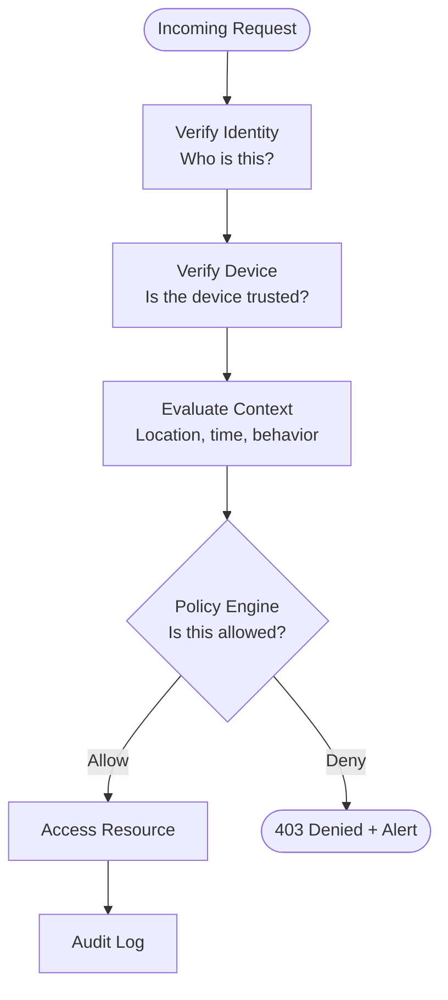

# Zero Trust Architecture

> Never trust, always verify — treat every request as potentially hostile regardless of where it originates.

---

## The Problem with Perimeter Security

Traditional security drew a hard boundary around the corporate network ("the castle and moat"). Once inside the perimeter, users and services trusted each other implicitly.

This model breaks down because:

- Employees use laptops on coffee shop WiFi
- Applications run in cloud regions with no fixed perimeter
- Compromised internal services can move laterally without restriction
- Contractors, SaaS tools, and CI pipelines all "touch" the internal network
- One phishing email can get an attacker inside the perimeter

```
Traditional Model (broken):
┌────────────────────────────────────┐
│  Corporate Network                 │
│  ┌──────┐  ┌──────┐  ┌──────┐    │  ← Anyone inside can talk to anyone
│  │  DB  │←─│  API │←─│  UI  │    │
│  └──────┘  └──────┘  └──────┘    │
└────────────────────────────────────┘
         ↑ Firewall keeps attackers OUT
           But if they get in, game over.
```

---

## Zero Trust Core Principles

1. **Verify explicitly** — Authenticate and authorize every request, every time
2. **Least privilege** — Grant only the access required for the specific task
3. **Assume breach** — Design as if the attacker is already inside



---

## Zero Trust in Code: Authentication on Every Request

```python
# Every service verifies the token — there is no "trusted internal caller"
from functools import wraps
from flask import request, jsonify
import jwt

def zero_trust_auth(required_scope: str = None):
    def decorator(f):
        @wraps(f)
        def wrapper(*args, **kwargs):
            # 1. Require a token — always, even from internal services
            token = _extract_bearer_token(request)
            if not token:
                return jsonify({"error": "No credentials provided"}), 401

            # 2. Validate the token cryptographically
            try:
                payload = jwt.decode(token, PUBLIC_KEY, algorithms=["RS256"])
            except jwt.ExpiredSignatureError:
                return jsonify({"error": "Token expired"}), 401
            except jwt.InvalidTokenError:
                return jsonify({"error": "Invalid token"}), 401

            # 3. Check scope (least privilege)
            if required_scope and required_scope not in payload.get("scopes", []):
                return jsonify({"error": "Insufficient scope"}), 403

            # 4. Log every access decision
            audit_log(
                actor=payload["sub"],
                action=request.method + " " + request.path,
                allowed=True,
            )

            request.identity = payload
            return f(*args, **kwargs)
        return wrapper
    return decorator


def _extract_bearer_token(req) -> str | None:
    auth = req.headers.get("Authorization", "")
    if auth.startswith("Bearer "):
        return auth.split(" ")[1]
    return None
```

---

## Microsegmentation

Microsegmentation restricts which services can talk to which, even within the same internal network. Instead of "all services on this subnet can talk to each other," you define explicit allow lists.

```python
# Service-to-service call: each service presents its own identity
import httpx
from myapp.identity import ServiceIdentityProvider

class OrderService:
    def __init__(self, identity: ServiceIdentityProvider):
        self._identity = identity

    def confirm_payment(self, order_id: int) -> dict:
        # Present a service token with a narrow scope
        token = self._identity.get_service_token(
            audience="payment-service",
            scopes=["payments:confirm"],
        )

        response = httpx.post(
            "https://payment-service.internal/payments/confirm",
            json={"order_id": order_id},
            headers={
                "Authorization": f"Bearer {token}",
                "X-Request-ID": generate_request_id(),    # for tracing
            },
            timeout=5.0,
        )
        response.raise_for_status()
        return response.json()
```

Kubernetes NetworkPolicy enforces this at the infrastructure level:

```yaml
# Only allow the order-service to call the payment-service on port 8080
apiVersion: networking.k8s.io/v1
kind: NetworkPolicy
metadata:
  name: payment-service-ingress
  namespace: production
spec:
  podSelector:
    matchLabels:
      app: payment-service
  policyTypes:
    - Ingress
  ingress:
    - from:
        - podSelector:
            matchLabels:
              app: order-service
      ports:
        - protocol: TCP
          port: 8080
```

---

## Policy Engine: Open Policy Agent (OPA)

A centralized policy engine evaluates authorization decisions outside your application code. Policies are written in Rego and can be updated without redeploying the application.

```python
# Instead of hardcoding authorization logic:
# if user.role == "admin" or user.id == resource.owner_id: ...

# Query a policy engine:
import httpx

class PolicyEngine:
    def __init__(self, opa_url: str = "http://opa:8181"):
        self._url = opa_url

    def is_allowed(self, principal: dict, action: str, resource: dict) -> bool:
        response = httpx.post(
            f"{self._url}/v1/data/myapp/authz/allow",
            json={
                "input": {
                    "principal": principal,     # {"user_id": 42, "roles": ["editor"]}
                    "action": action,           # "documents:edit"
                    "resource": resource,       # {"owner_id": 42, "sensitivity": "low"}
                }
            },
            timeout=1.0,
        )
        return response.json().get("result", False)
```

OPA policy in Rego:

```rego
# policy.rego
package myapp.authz

default allow = false

# Admins can do anything
allow {
    "admin" in input.principal.roles
}

# Users can edit their own documents
allow {
    input.action == "documents:edit"
    input.resource.owner_id == input.principal.user_id
}

# Editors can edit low-sensitivity documents
allow {
    input.action == "documents:edit"
    "editor" in input.principal.roles
    input.resource.sensitivity == "low"
}
```

---

## Least Privilege in Practice

```python
# BAD: broad permissions
IAM_POLICY = {
    "Action": ["s3:*"],
    "Resource": "*",
}

# GOOD: only what this service needs
IAM_POLICY = {
    "Action": [
        "s3:GetObject",        # read objects
        "s3:PutObject",        # write objects
    ],
    "Resource": "arn:aws:s3:::my-app-uploads/*",   # only this bucket
    "Condition": {
        "StringEquals": {
            "aws:RequestedRegion": "us-east-1"     # only this region
        }
    }
}
```

```python
# BAD: service account with cluster-admin
# GOOD: role with only what the service needs

# Kubernetes RBAC — least privilege service account
apiVersion: rbac.authorization.k8s.io/v1
kind: Role
metadata:
  name: order-service-role
  namespace: production
rules:
  - apiGroups: [""]
    resources: ["configmaps"]
    verbs: ["get"]             # read-only, only configmaps, only in this namespace
```

---

## Continuous Verification

Zero Trust doesn't just verify at login — it re-evaluates on every request.

```python
class ContinuousVerificationMiddleware:
    def __init__(self, app):
        self._app = app

    def __call__(self, environ, start_response):
        request = Request(environ)
        token = _extract_bearer_token(request)

        if token:
            payload = verify_token(token)

            # Re-check: is the user's account still active?
            if not user_is_active(payload["user_id"]):
                return unauthorized(start_response)

            # Re-check: has the user's IP changed suspiciously?
            if is_suspicious_location(payload, request.remote_addr):
                revoke_token(token)
                return unauthorized(start_response)

        return self._app(environ, start_response)
```

---

## Zero Trust Checklist

```
Authentication
  ✓ Every request carries a credential (no "internal trusted caller")
  ✓ Tokens are short-lived (< 15 minutes for access tokens)
  ✓ Service-to-service calls use service identity tokens

Authorization
  ✓ Least privilege — minimal scopes and permissions
  ✓ Policy engine (OPA or similar) — no hardcoded role checks
  ✓ Re-evaluated per request, not just at login

Network
  ✓ Microsegmentation — explicit allow lists between services
  ✓ Mutual TLS (mTLS) — both sides of the connection are authenticated
  ✓ No implicit trust based on IP address or subnet

Observability
  ✓ Every access decision is logged (allow and deny)
  ✓ Anomalous access patterns trigger alerts
  ✓ Token usage is auditable
```

---

## Key Takeaways

- Perimeter security fails when the attacker is already inside — Zero Trust eliminates the concept of a "trusted interior."
- Verify every request: authenticate with a token, authorize with a policy engine, log every decision.
- Least privilege: grant only the specific permissions needed for the specific task, not broad roles.
- Microsegmentation restricts service-to-service communication explicitly — use NetworkPolicies and mTLS.
- Assume breach: design systems so that compromising one service does not mean compromising all services.
