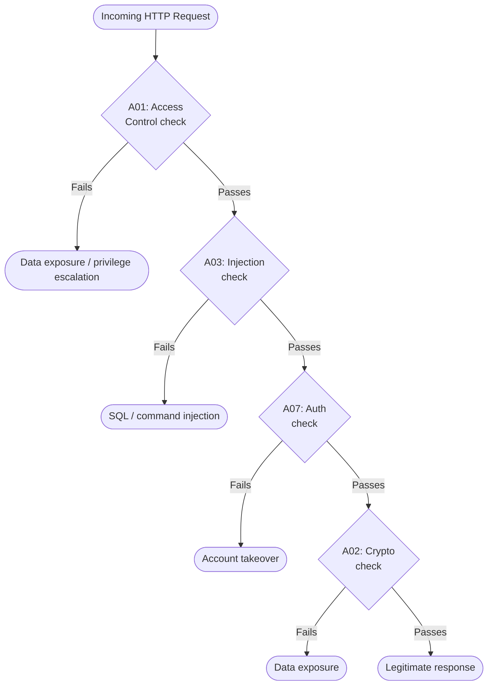

# OWASP Top 10

> The ten most critical web application security risks — with attack scenarios and mitigation code for each.

The OWASP Top 10 (2021 edition) is the authoritative list of the most common and impactful web security vulnerabilities. Every application should be designed to prevent all ten.

---

## Attack Surface Overview



---

## A01 — Broken Access Control

The most critical. Users can act outside their intended permissions — viewing other users' data, escalating privileges, accessing admin functions.

**Attack scenario:**
```
GET /api/invoices/1042   ← User 99 retrieves User 42's invoice
Authorization: Bearer <user-99-token>
→ 200 OK {"invoice": {...}}   ← Oops
```

**Mitigation:**
```python
@app.get("/api/invoices/<int:invoice_id>")
@require_auth
def get_invoice(invoice_id: int):
    invoice = Invoice.query.get_or_404(invoice_id)

    # ALWAYS verify ownership or role — never trust the URL parameter alone
    if invoice.owner_id != request.user_id and "admin" not in request.roles:
        abort(403)

    return jsonify(invoice.to_dict())
```

**Rules:**
- Deny by default — if there's no explicit allow, deny
- Enforce access control server-side — client-side checks are trivially bypassed
- Log access control failures and alert on repeated failures

---

## A02 — Cryptographic Failures

Sensitive data exposed due to weak or missing encryption: passwords in plain text, transmitting data over HTTP, using weak algorithms (MD5, SHA1).

**Attack scenario:**
```sql
-- Database dump reveals:
SELECT password FROM users;
-- 5f4dcc3b5aa765d61d8327deb882cf99  ← MD5("password")
-- crack.sh cracks this in milliseconds
```

**Mitigation:**
```python
import bcrypt
import secrets

# Password hashing — use bcrypt or argon2, NEVER MD5/SHA1/SHA256
def hash_password(plain: str) -> str:
    return bcrypt.hashpw(plain.encode(), bcrypt.gensalt(rounds=12)).decode()

def check_password(plain: str, hashed: str) -> bool:
    return bcrypt.checkpw(plain.encode(), hashed.encode())

# Sensitive tokens — use cryptographically random values
def generate_reset_token() -> str:
    return secrets.token_urlsafe(32)   # 256 bits of entropy

# Never log or store sensitive data in plain text
class User:
    def to_dict(self) -> dict:
        return {
            "id": self.id,
            "email": self.email,
            # NEVER include: password_hash, api_key, ssn, credit_card
        }
```

**Rules:**
- HTTPS everywhere — HTTP is plaintext
- Use bcrypt (cost ≥ 12) or argon2id for passwords
- Encrypt sensitive data at rest with AES-256
- Never use MD5 or SHA1 for security purposes

---

## A03 — Injection

Untrusted data sent to an interpreter (SQL, shell, LDAP) is executed as a command.

**SQL Injection attack:**
```python
# BAD: f-string in SQL query
email = request.form["email"]   # attacker sends: ' OR '1'='1
query = f"SELECT * FROM users WHERE email = '{email}'"
# Becomes: SELECT * FROM users WHERE email = '' OR '1'='1'
# Returns ALL users
```

**Mitigation:**
```python
# GOOD: parameterized queries — always
import psycopg2

def get_user_by_email(conn, email: str) -> dict | None:
    with conn.cursor() as cur:
        cur.execute(
            "SELECT id, name, email FROM users WHERE email = %s",
            (email,)               # ← value passed separately, never interpolated
        )
        row = cur.fetchone()
    return {"id": row[0], "name": row[1], "email": row[2]} if row else None


# With ORM (SQLAlchemy)
def get_user_safe(email: str):
    return User.query.filter_by(email=email).first()   # parameterized automatically

# NEVER do this with ORM:
def get_user_unsafe(email: str):
    return db.session.execute(f"SELECT * FROM users WHERE email = '{email}'")
```

**Command Injection:**
```python
import subprocess, shlex

# BAD: shell=True with user input
filename = request.form["filename"]
subprocess.run(f"convert {filename} output.png", shell=True)
# Attacker sends: "input.jpg; rm -rf /"

# GOOD: pass arguments as a list, shell=False (default)
filename = request.form["filename"]
safe_filename = shlex.quote(filename)   # sanitize for display only
subprocess.run(["convert", filename, "output.png"])   # no shell interpretation
```

---

## A04 — Insecure Design

Security flaws baked into the architecture — not implementation bugs, but design decisions that have no secure implementation.

**Example:** A password reset flow that leaks valid email addresses:

```python
# BAD: response reveals whether email exists
@app.post("/reset-password")
def reset_password():
    email = request.json["email"]
    user = User.query.filter_by(email=email).first()
    if not user:
        return jsonify({"error": "No account with that email"}), 404  # leaks info!
    send_reset_email(user)
    return jsonify({"message": "Reset email sent"})

# GOOD: same response regardless of whether email exists
@app.post("/reset-password")
def reset_password():
    email = request.json["email"]
    user = User.query.filter_by(email=email).first()
    if user:
        send_reset_email(user)
    # Always return the same response — attacker cannot enumerate valid emails
    return jsonify({"message": "If that email exists, a reset link has been sent"})
```

**Rate limit sensitive operations:**
```python
from flask_limiter import Limiter

limiter = Limiter(app, key_func=lambda: request.remote_addr)

@app.post("/login")
@limiter.limit("5 per minute")     # brute force protection
def login():
    ...
```

---

## A05 — Security Misconfiguration

Default credentials, verbose error messages, unnecessary features enabled, missing security headers.

**Mitigation:**
```python
# Security headers — add to every response
@app.after_request
def add_security_headers(response):
    response.headers["Strict-Transport-Security"] = "max-age=31536000; includeSubDomains"
    response.headers["X-Content-Type-Options"] = "nosniff"
    response.headers["X-Frame-Options"] = "DENY"
    response.headers["Content-Security-Policy"] = (
        "default-src 'self'; "
        "script-src 'self'; "
        "style-src 'self'; "
        "img-src 'self' data:; "
        "object-src 'none'"
    )
    response.headers["Referrer-Policy"] = "strict-origin-when-cross-origin"
    response.headers["Permissions-Policy"] = "geolocation=(), camera=(), microphone=()"
    return response


# Disable debug mode in production
import os

app.config["DEBUG"] = os.getenv("FLASK_ENV") == "development"

# Generic error responses in production — never expose stack traces
@app.errorhandler(Exception)
def handle_exception(e):
    if app.debug:
        raise e
    app.logger.error(f"Unhandled exception: {e}", exc_info=True)
    return jsonify({"error": "Internal server error"}), 500
```

---

## A06 — Vulnerable and Outdated Components

Dependencies with known CVEs included in production.

**Mitigation:**
```bash
# Audit Python dependencies for known vulnerabilities
pip install pip-audit
pip-audit

# Output:
# Package   Version  Vulnerability  Fix
# urllib3   1.26.4   CVE-2023-43804 upgrade to 1.26.18

# Automated via GitHub Dependabot (.github/dependabot.yml):
```

```yaml
version: 2
updates:
  - package-ecosystem: "pip"
    directory: "/"
    schedule:
      interval: "weekly"
    open-pull-requests-limit: 10
```

---

## A07 — Identification and Authentication Failures

Weak passwords accepted, no account lockout, predictable session IDs, credentials in URLs.

**Mitigation:**
```python
import re
from collections import defaultdict
from datetime import datetime, timedelta

# Enforce password strength
def validate_password_strength(password: str) -> None:
    if len(password) < 12:
        raise ValueError("Password must be at least 12 characters")
    if not re.search(r"[A-Z]", password):
        raise ValueError("Must contain uppercase")
    if not re.search(r"[0-9]", password):
        raise ValueError("Must contain a digit")
    if not re.search(r"[^a-zA-Z0-9]", password):
        raise ValueError("Must contain a special character")


# Account lockout after failed attempts
_login_attempts: dict[str, list[datetime]] = defaultdict(list)
MAX_ATTEMPTS = 5
LOCKOUT_WINDOW = timedelta(minutes=15)

def check_lockout(email: str) -> None:
    cutoff = datetime.utcnow() - LOCKOUT_WINDOW
    recent = [t for t in _login_attempts[email] if t > cutoff]
    _login_attempts[email] = recent

    if len(recent) >= MAX_ATTEMPTS:
        raise TooManyAttemptsError("Account temporarily locked")

def record_failed_attempt(email: str) -> None:
    _login_attempts[email].append(datetime.utcnow())
```

---

## A08 — Software and Data Integrity Failures

Code and infrastructure not protected against unauthorized modifications. CI pipelines that pull and run untrusted plugins or scripts.

**Mitigation:**
```yaml
# Pin dependency hashes in requirements.txt
# pip freeze > requirements.txt  (includes hashes with --require-hashes)

# requirements.txt
flask==3.0.0 \
    --hash=sha256:5f873c5184c897c2adeff...

# Verify downloaded artifacts
# pyproject.toml — use exact versions + lock files (poetry.lock, pip.lock)
```

```python
# Sign and verify webhook payloads (e.g., GitHub webhooks)
import hashlib, hmac

def verify_github_webhook(payload: bytes, signature: str, secret: str) -> bool:
    expected = "sha256=" + hmac.new(
        secret.encode(), payload, hashlib.sha256
    ).hexdigest()
    return hmac.compare_digest(expected, signature)   # constant-time comparison


@app.post("/webhooks/github")
def github_webhook():
    sig = request.headers.get("X-Hub-Signature-256", "")
    if not verify_github_webhook(request.data, sig, WEBHOOK_SECRET):
        abort(403)
    process_event(request.json)
    return "", 200
```

---

## A09 — Security Logging and Monitoring Failures

Not logging security events, or not acting on them. An attacker can operate undetected for months.

**Mitigation:**
```python
import logging
import structlog

log = structlog.get_logger()

def login(email: str, password: str) -> dict:
    user = User.query.filter_by(email=email).first()

    if not user or not check_password(password, user.password_hash):
        log.warning(
            "login_failed",
            email=email,
            ip=request.remote_addr,
            user_agent=request.user_agent.string,
        )
        raise AuthenticationError("Invalid credentials")

    log.info(
        "login_success",
        user_id=user.id,
        ip=request.remote_addr,
    )
    return create_tokens(user)


# Structured logs can feed into SIEM tools (Splunk, Datadog, Elastic)
# Alert on: 5+ failed logins per minute, login from new country, privilege escalation
```

---

## A10 — Server-Side Request Forgery (SSRF)

The server is tricked into making HTTP requests to internal resources on behalf of the attacker.

**Attack scenario:**
```
POST /api/fetch-preview
{"url": "http://169.254.169.254/latest/meta-data/iam/security-credentials/"}

→ The server fetches AWS instance metadata and returns the IAM credentials to the attacker.
```

**Mitigation:**
```python
import httpx
from urllib.parse import urlparse
import ipaddress

ALLOWED_SCHEMES = {"http", "https"}
BLOCKED_PRIVATE_RANGES = [
    ipaddress.ip_network("10.0.0.0/8"),
    ipaddress.ip_network("172.16.0.0/12"),
    ipaddress.ip_network("192.168.0.0/16"),
    ipaddress.ip_network("169.254.0.0/16"),   # AWS metadata
    ipaddress.ip_network("127.0.0.0/8"),      # localhost
    ipaddress.ip_network("::1/128"),          # IPv6 localhost
]

def is_safe_url(url: str) -> bool:
    parsed = urlparse(url)

    if parsed.scheme not in ALLOWED_SCHEMES:
        return False

    try:
        # Resolve the hostname to its IP address
        import socket
        ip = ipaddress.ip_address(socket.gethostbyname(parsed.hostname))
    except (socket.gaierror, ValueError):
        return False

    # Reject private/internal IP ranges
    for blocked in BLOCKED_PRIVATE_RANGES:
        if ip in blocked:
            return False

    return True


@app.post("/api/fetch-preview")
@require_auth
def fetch_preview():
    url = request.json.get("url", "")

    if not is_safe_url(url):
        return jsonify({"error": "URL not allowed"}), 422

    response = httpx.get(url, timeout=5.0, follow_redirects=False)
    return jsonify({"content": response.text[:1000]})
```

---

## Summary Table

| # | Risk | Key Mitigation |
|---|------|---------------|
| A01 | Broken Access Control | Enforce ownership checks server-side; deny by default |
| A02 | Cryptographic Failures | HTTPS; bcrypt; AES-256 at rest; no MD5/SHA1 |
| A03 | Injection | Parameterized queries; never interpolate user input into commands |
| A04 | Insecure Design | Same response for valid/invalid emails; rate limit sensitive ops |
| A05 | Security Misconfiguration | Security headers; disable debug; generic error responses |
| A06 | Vulnerable Components | `pip-audit`; pin versions; Dependabot |
| A07 | Auth Failures | Password strength; account lockout; bcrypt |
| A08 | Integrity Failures | Hash pinning; verify webhook signatures |
| A09 | Logging Failures | Log all auth events; alert on anomalies |
| A10 | SSRF | Validate and resolve URLs; block private IP ranges |

---

## Key Takeaways

- Access control must be enforced server-side on every request — never trust the client.
- Parameterized queries are the complete defense against SQL injection — no exceptions.
- Use bcrypt or argon2id for passwords, HTTPS for transport, AES-256 for data at rest.
- Security headers, rate limiting, and account lockout are cheap controls with high impact.
- Log every authentication and authorization event — silent breaches are the most damaging.
