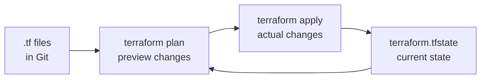

# Infrastructure as Code (IaC)

> Define, version, and manage infrastructure — servers, databases, networks — in code files, the same way you manage application code.

---

## The Problem with Manual Infrastructure

Manually clicking through cloud consoles to create servers, databases, and networks causes:

- **Configuration drift**: production drifts from staging over time because changes are applied inconsistently
- **No audit trail**: nobody knows who changed the security group rule last Tuesday
- **No reproducibility**: "spin up a new environment like production" takes days of tribal knowledge
- **No rollback**: you can't `git revert` a manual change

---

## What IaC Looks Like

Instead of clicking in the AWS console, you write a Terraform file:

```hcl
# Before IaC:
# 1. Log in to AWS console
# 2. Click EC2 → Launch Instance
# 3. Choose t3.medium
# 4. Add security group manually
# 5. ... repeat for staging, dev, disaster recovery

# With IaC:
resource "aws_instance" "api_server" {
  ami           = "ami-0c55b159cbfafe1f0"
  instance_type = "t3.medium"

  vpc_security_group_ids = [aws_security_group.api.id]
  subnet_id              = aws_subnet.private.id

  tags = {
    Name        = "api-server"
    Environment = var.environment
  }
}
```

Running `terraform apply` creates the server. Running `terraform destroy` removes it. The config is in Git.

---

## Terraform: Core Concepts



### 1. Providers

```hcl
terraform {
  required_providers {
    aws = {
      source  = "hashicorp/aws"
      version = "~> 5.0"
    }
  }

  # Remote state — shared with the team, not a local file
  backend "s3" {
    bucket         = "my-terraform-state"
    key            = "production/terraform.tfstate"
    region         = "us-east-1"
    encrypt        = true
    dynamodb_table = "terraform-lock"    # prevents concurrent applies
  }
}

provider "aws" {
  region = "us-east-1"
}
```

### 2. Variables and Outputs

```hcl
# variables.tf
variable "environment" {
  description = "Deployment environment"
  type        = string
  validation {
    condition     = contains(["dev", "staging", "production"], var.environment)
    error_message = "Environment must be dev, staging, or production."
  }
}

variable "instance_type" {
  type    = string
  default = "t3.micro"
}

# outputs.tf
output "api_server_public_ip" {
  value       = aws_instance.api_server.public_ip
  description = "Public IP of the API server"
}
```

### 3. A Complete Example: VPC + EC2 + RDS + Security Groups

```hcl
# main.tf

# ── Network ─────────────────────────────────────────────────────────────────

resource "aws_vpc" "main" {
  cidr_block           = "10.0.0.0/16"
  enable_dns_hostnames = true
  tags = { Name = "${var.environment}-vpc" }
}

resource "aws_subnet" "public" {
  vpc_id            = aws_vpc.main.id
  cidr_block        = "10.0.1.0/24"
  availability_zone = "us-east-1a"
  tags = { Name = "${var.environment}-public" }
}

resource "aws_subnet" "private" {
  vpc_id            = aws_vpc.main.id
  cidr_block        = "10.0.2.0/24"
  availability_zone = "us-east-1a"
  tags = { Name = "${var.environment}-private" }
}

# ── Security Groups ─────────────────────────────────────────────────────────

resource "aws_security_group" "api" {
  name   = "${var.environment}-api-sg"
  vpc_id = aws_vpc.main.id

  ingress {
    from_port   = 443
    to_port     = 443
    protocol    = "tcp"
    cidr_blocks = ["0.0.0.0/0"]
  }

  egress {
    from_port   = 0
    to_port     = 0
    protocol    = "-1"
    cidr_blocks = ["0.0.0.0/0"]
  }
}

resource "aws_security_group" "db" {
  name   = "${var.environment}-db-sg"
  vpc_id = aws_vpc.main.id

  ingress {
    from_port       = 5432
    to_port         = 5432
    protocol        = "tcp"
    security_groups = [aws_security_group.api.id]   # only the API can reach the DB
  }
}

# ── Compute ─────────────────────────────────────────────────────────────────

resource "aws_instance" "api" {
  ami                    = data.aws_ami.ubuntu.id
  instance_type          = var.instance_type
  subnet_id              = aws_subnet.private.id
  vpc_security_group_ids = [aws_security_group.api.id]

  user_data = base64encode(<<-EOT
    #!/bin/bash
    apt-get update
    apt-get install -y docker.io
    docker run -d -p 8080:8080 \
      -e DATABASE_URL="${aws_db_instance.main.endpoint}" \
      ghcr.io/myorg/myapp:latest
  EOT
  )

  tags = { Name = "${var.environment}-api" }
}

# ── Database ─────────────────────────────────────────────────────────────────

resource "aws_db_instance" "main" {
  identifier        = "${var.environment}-db"
  engine            = "postgres"
  engine_version    = "15.3"
  instance_class    = "db.t3.micro"
  allocated_storage = 20

  db_name  = "appdb"
  username = "appuser"
  password = var.db_password     # passed as a secret, never hardcoded

  vpc_security_group_ids = [aws_security_group.db.id]
  db_subnet_group_name   = aws_db_subnet_group.main.name

  backup_retention_period = 7       # 7-day automated backups
  deletion_protection     = var.environment == "production"
  skip_final_snapshot     = var.environment != "production"

  tags = { Environment = var.environment }
}
```

---

## Drift Detection

Configuration drift happens when someone manually changes infrastructure outside of Terraform. Detect it with `terraform plan`:

```bash
# Shows what Terraform would change to match the declared state
terraform plan

# If someone manually changed a security group rule:
# ~ resource "aws_security_group" "api" {
#   ~ ingress {
#     ~ cidr_blocks = [
#         "0.0.0.0/0"
#       + "10.0.0.0/8"    ← someone added this manually
#       ]
#   }
# }

# Fix drift: apply the declared state, removing the manual change
terraform apply
```

Automate drift detection in CI:

```yaml
# .github/workflows/drift.yml
name: Detect Infrastructure Drift

on:
  schedule:
    - cron: "0 8 * * *"    # daily at 8am

jobs:
  drift-check:
    runs-on: ubuntu-latest
    steps:
      - uses: actions/checkout@v4

      - name: Terraform plan
        id: plan
        run: terraform plan -detailed-exitcode
        continue-on-error: true

      - name: Alert on drift
        if: steps.plan.outputs.exitcode == '2'   # 2 = changes detected
        run: |
          echo "::warning::Infrastructure drift detected — run terraform apply"
```

---

## Immutable Infrastructure

Instead of updating servers in place (patching, SSH-ing in, changing configs), you replace them:

```
Mutable Infrastructure (risky):
  Server A v1.0 → SSH in → patch → Server A v1.1   (unknown intermediate state)

Immutable Infrastructure (safe):
  Server A v1.0   →   Build new AMI   →   Launch Server A v2.0   →   Terminate v1.0
                                           ↑ starts fresh every time
```

```hcl
# Build a new AMI on every deploy using Packer
resource "aws_autoscaling_group" "api" {
  name                = "${var.app_version}-asg"   # new ASG per version
  launch_template {
    id      = aws_launch_template.api.id
    version = "$Latest"
  }

  min_size         = 2
  max_size         = 10
  desired_capacity = 3

  # New ASG starts, gets healthy, then old ASG is terminated
  lifecycle {
    create_before_destroy = true
  }
}
```

---

## Modules — Reusable Infrastructure Components

```hcl
# modules/web-service/main.tf
variable "service_name" {}
variable "docker_image"  {}
variable "port"          { default = 8080 }

resource "aws_ecs_service" "this" {
  name            = var.service_name
  task_definition = aws_ecs_task_definition.this.arn
  desired_count   = 2
  ...
}

# ── Using the module: ──────────────────────────────────────────────────────

module "order_service" {
  source       = "./modules/web-service"
  service_name = "order-service"
  docker_image = "ghcr.io/myorg/order-service:${var.version}"
}

module "payment_service" {
  source       = "./modules/web-service"
  service_name = "payment-service"
  docker_image = "ghcr.io/myorg/payment-service:${var.version}"
  port         = 9090
}
```

---

## Key Takeaways

- Infrastructure as Code eliminates configuration drift, manual errors, and "works in staging but not production" problems.
- Terraform's `plan` shows what will change before it changes — review it before every `apply`.
- Remote state (S3 + DynamoDB lock) is mandatory for team use — never commit `terraform.tfstate` to Git.
- Immutable infrastructure replaces servers rather than patching them, eliminating unknown intermediate states.
- Modules let you define a reusable infrastructure pattern (a web service, a database) and instantiate it multiple times.
