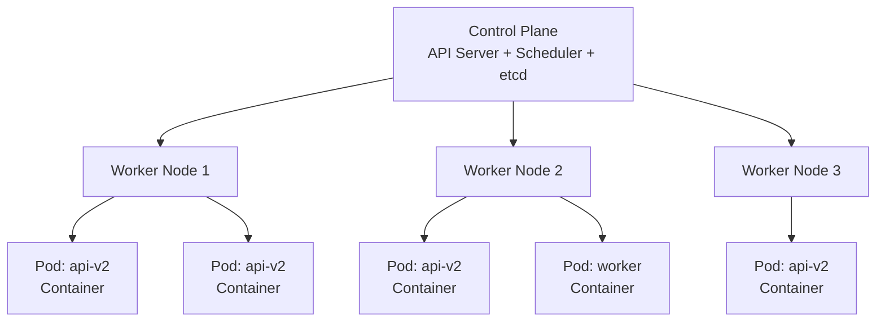
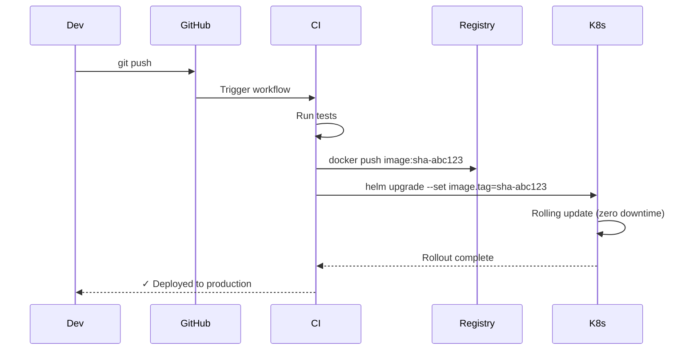

# Containers and Orchestration

> Package applications with their dependencies into portable containers, then run them reliably at scale with Kubernetes.

---

## The Problem

"It works on my machine" is a symptom of environment inconsistency:

- Different Python versions, library versions, OS libraries across dev/staging/production
- Manual server setup that diverges over time
- Scaling horizontally means setting up each new server identically
- Running multiple services on one server causes dependency conflicts

---

## Containers vs. Virtual Machines

```
Virtual Machine:                     Container:
┌──────────────────────┐             ┌──────────────────────┐
│  App A               │             │  App A               │
│  Libraries           │             │  Libraries           │
│  Guest OS (2GB+)     │             ├──────────────────────┤
├──────────────────────┤             │  Container Runtime   │
│  Hypervisor          │             │  (Docker / containerd│
├──────────────────────┤             │  shares host kernel) │
│  Host OS             │             ├──────────────────────┤
│  Hardware            │             │  Host OS + Hardware  │
└──────────────────────┘             └──────────────────────┘

→ GB of overhead, minutes to boot    → MB overhead, seconds to start
→ Full OS isolation                  → Process isolation, shared kernel
```

---

## Docker: Building a Container Image

### Dockerfile

```dockerfile
# Start from a minimal, known base image
FROM python:3.12-slim AS base

# Security: don't run as root
RUN useradd --create-home appuser

WORKDIR /app

# Install dependencies separately from code
# — Docker caches this layer; only re-runs when requirements.txt changes
FROM base AS deps
COPY requirements.txt .
RUN pip install --no-cache-dir -r requirements.txt

# Copy application code
FROM deps AS app
COPY --chown=appuser:appuser src/ ./src/

USER appuser

# Document which port the app listens on
EXPOSE 8080

# Health check so orchestrators know when the container is ready
HEALTHCHECK --interval=30s --timeout=5s --retries=3 \
  CMD curl -f http://localhost:8080/health || exit 1

CMD ["python", "-m", "uvicorn", "src.main:app", "--host", "0.0.0.0", "--port", "8080"]
```

```bash
# Build
docker build -t myapp:1.0.0 .

# Run locally
docker run -p 8080:8080 -e DATABASE_URL=postgresql://... myapp:1.0.0

# Push to registry
docker tag myapp:1.0.0 ghcr.io/myorg/myapp:1.0.0
docker push ghcr.io/myorg/myapp:1.0.0
```

---

## Docker Compose: Local Multi-Service Development

```yaml
# docker-compose.yml
version: "3.9"

services:
  api:
    build: .
    ports:
      - "8080:8080"
    environment:
      DATABASE_URL: postgresql://appuser:devpass@db:5432/appdb
      REDIS_URL: redis://cache:6379
    depends_on:
      db:
        condition: service_healthy
      cache:
        condition: service_started
    volumes:
      - ./src:/app/src    # hot-reload during development

  db:
    image: postgres:15
    environment:
      POSTGRES_USER: appuser
      POSTGRES_PASSWORD: devpass
      POSTGRES_DB: appdb
    volumes:
      - postgres_data:/var/lib/postgresql/data
    healthcheck:
      test: ["CMD", "pg_isready", "-U", "appuser"]
      interval: 5s
      retries: 5

  cache:
    image: redis:7-alpine
    ports:
      - "6379:6379"

volumes:
  postgres_data:
```

```bash
docker compose up --build      # start all services
docker compose down -v         # stop and remove volumes
```

---

## Kubernetes: Container Orchestration

Kubernetes (K8s) manages containers across a cluster of machines:
- Schedules containers onto available nodes
- Restarts crashed containers
- Scales up/down based on load
- Routes traffic to healthy instances
- Rolls out updates with zero downtime



---

## Core Kubernetes Objects

### Deployment — Manages Replicated Pods

```yaml
# deployment.yaml
apiVersion: apps/v1
kind: Deployment
metadata:
  name: api
  namespace: production
spec:
  replicas: 3
  selector:
    matchLabels:
      app: api
  strategy:
    type: RollingUpdate
    rollingUpdate:
      maxSurge: 1           # create 1 extra pod before terminating old ones
      maxUnavailable: 0     # never reduce below desired count during update
  template:
    metadata:
      labels:
        app: api
        version: "1.2.0"
    spec:
      containers:
        - name: api
          image: ghcr.io/myorg/myapp:1.2.0
          ports:
            - containerPort: 8080
          env:
            - name: DATABASE_URL
              valueFrom:
                secretKeyRef:
                  name: db-credentials
                  key: url
          resources:
            requests:
              cpu: "100m"       # 0.1 CPU cores — what the pod is guaranteed
              memory: "128Mi"
            limits:
              cpu: "500m"       # 0.5 CPU cores — the maximum it can use
              memory: "512Mi"
          readinessProbe:       # traffic only sent when this passes
            httpGet:
              path: /health
              port: 8080
            initialDelaySeconds: 5
            periodSeconds: 10
          livenessProbe:        # pod restarted if this fails
            httpGet:
              path: /health
              port: 8080
            initialDelaySeconds: 15
            failureThreshold: 3
```

### Service — Stable Network Endpoint

```yaml
# service.yaml
apiVersion: v1
kind: Service
metadata:
  name: api
  namespace: production
spec:
  selector:
    app: api              # routes to any pod with this label
  ports:
    - protocol: TCP
      port: 80            # port clients connect to
      targetPort: 8080    # port the container listens on
  type: ClusterIP         # internal only; use LoadBalancer for external traffic
```

### Ingress — HTTP Routing

```yaml
# ingress.yaml
apiVersion: networking.k8s.io/v1
kind: Ingress
metadata:
  name: api-ingress
  namespace: production
  annotations:
    cert-manager.io/cluster-issuer: letsencrypt-prod
    nginx.ingress.kubernetes.io/rate-limit: "100"
spec:
  ingressClassName: nginx
  tls:
    - hosts:
        - api.myapp.com
      secretName: api-tls
  rules:
    - host: api.myapp.com
      http:
        paths:
          - path: /
            pathType: Prefix
            backend:
              service:
                name: api
                port:
                  number: 80
```

### ConfigMap and Secret

```yaml
# configmap.yaml — non-sensitive configuration
apiVersion: v1
kind: ConfigMap
metadata:
  name: api-config
  namespace: production
data:
  LOG_LEVEL: "info"
  MAX_CONNECTIONS: "100"

---
# secret.yaml — sensitive values (base64-encoded, managed by sealed-secrets or Vault)
apiVersion: v1
kind: Secret
metadata:
  name: db-credentials
  namespace: production
type: Opaque
stringData:
  url: "postgresql://appuser:securepass@db:5432/appdb"
```

### HorizontalPodAutoscaler — Auto-scaling

```yaml
# hpa.yaml
apiVersion: autoscaling/v2
kind: HorizontalPodAutoscaler
metadata:
  name: api-hpa
  namespace: production
spec:
  scaleTargetRef:
    apiVersion: apps/v1
    kind: Deployment
    name: api
  minReplicas: 3
  maxReplicas: 20
  metrics:
    - type: Resource
      resource:
        name: cpu
        target:
          type: Utilization
          averageUtilization: 70    # scale up when average CPU > 70%
```

---

## Helm: Kubernetes Package Manager

Helm packages Kubernetes manifests into reusable, configurable charts.

```
my-app-chart/
├── Chart.yaml           ← chart metadata
├── values.yaml          ← default configuration values
└── templates/
    ├── deployment.yaml  ← uses {{ .Values.image.tag }}
    ├── service.yaml
    ├── ingress.yaml
    └── hpa.yaml
```

```yaml
# values.yaml
image:
  repository: ghcr.io/myorg/myapp
  tag: "1.2.0"

replicaCount: 3

resources:
  requests:
    cpu: 100m
    memory: 128Mi
  limits:
    cpu: 500m
    memory: 512Mi

ingress:
  enabled: true
  host: api.myapp.com
```

```yaml
# templates/deployment.yaml
apiVersion: apps/v1
kind: Deployment
metadata:
  name: {{ .Release.Name }}-api
spec:
  replicas: {{ .Values.replicaCount }}
  template:
    spec:
      containers:
        - name: api
          image: "{{ .Values.image.repository }}:{{ .Values.image.tag }}"
          resources:
            {{- toYaml .Values.resources | nindent 12 }}
```

```bash
# Install / upgrade
helm upgrade --install myapp ./my-app-chart \
  --namespace production \
  --set image.tag=1.3.0

# Preview what will be applied
helm template myapp ./my-app-chart --set image.tag=1.3.0

# Roll back
helm rollback myapp 1
```

---

## Deploy Workflow: Code to Production



---

## Key Takeaways

- Containers package an app and all its dependencies into a portable, reproducible unit — eliminating "works on my machine."
- Docker multi-stage builds keep images small; always run as a non-root user.
- Docker Compose runs multi-service stacks locally for development.
- Kubernetes manages containers at scale: scheduling, health checks, rolling updates, auto-scaling.
- Readiness probes prevent traffic from reaching unhealthy pods; liveness probes restart stuck pods.
- Helm makes Kubernetes deployments configurable and repeatable — one chart, many environments.
