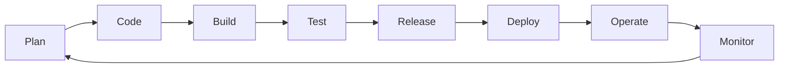

# 07 — DevOps & Infrastructure

> Automate the path from code change to production — reliably, repeatably, and safely.

DevOps is not a tool or a team structure. It is the practice of treating infrastructure and deployment as software: versioned, tested, and automated.

## Topics

| # | Topic | Core Idea |
|---|-------|-----------|
| 1 | [CI/CD](./01-cicd.md) | Automate build, test, and deploy pipelines |
| 2 | [Infrastructure as Code](./02-infrastructure-as-code.md) | Define infrastructure in version-controlled files |
| 3 | [Containers & Orchestration](./03-containers-orchestration.md) | Package apps in containers; run them at scale with Kubernetes |

## The DevOps Loop

Each stage feeds into the next. Automation at every stage is what allows teams to ship safely multiple times per day.
